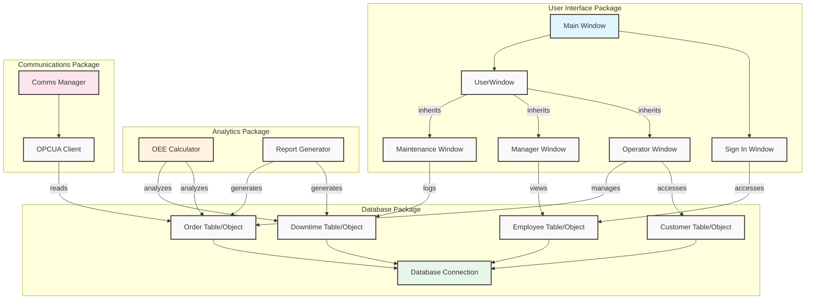
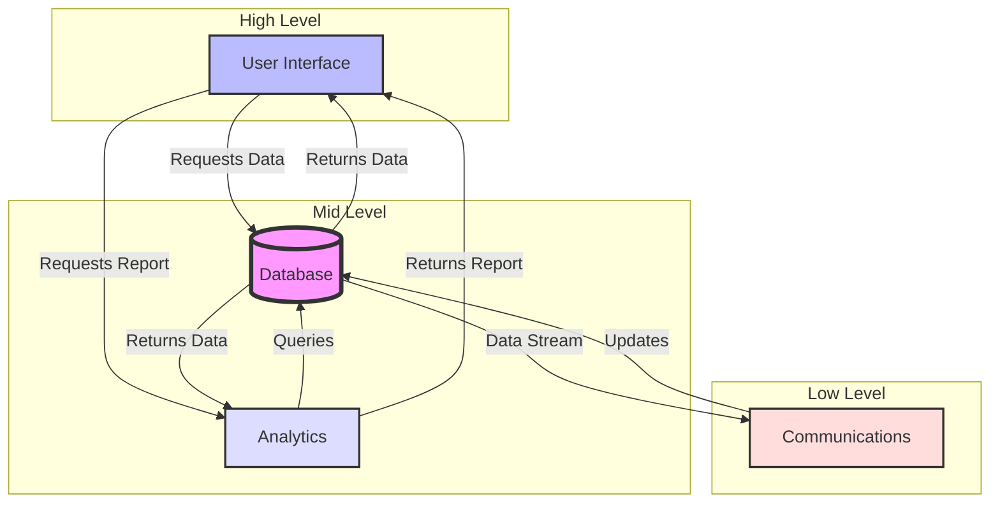
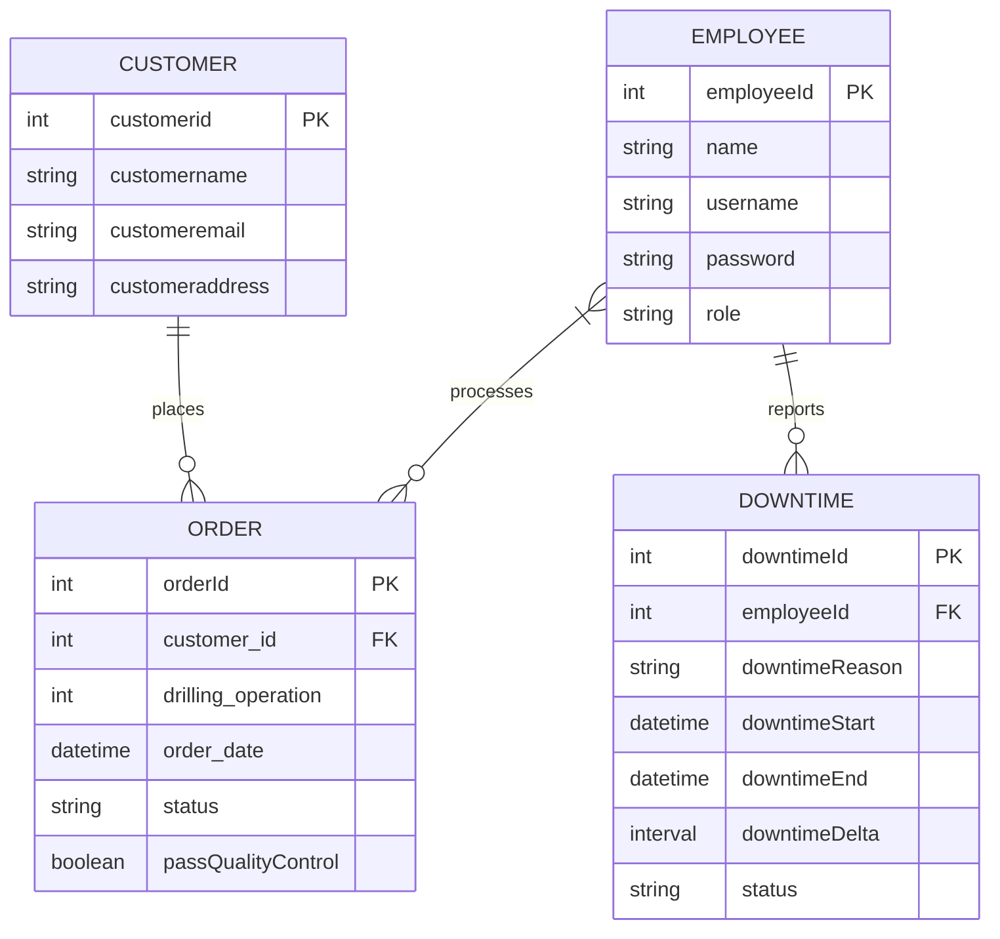

# MANF455
MES

```mermaid
graph TB
    %% Define the Database Package at the top
    subgraph "Database Package"
        DBConnection[Database Connection]
        CustomerTable[Customer Table/Object] --> DBConnection
        DowntimeTable[Downtime Table/Object] --> DBConnection
        EmployeeTable[Employee Table/Object] --> DBConnection
        OrderTable[Order Table/Object] --> DBConnection
        
        class DBConnection,CustomerTable,DowntimeTable,EmployeeTable,OrderTable innerGraph
    end
    
    %% Define the User Interface Package lower down
    subgraph "User Interface Package"
        MainWindow[Main Window] --> UserWindow
        UserWindow --> |inherits| MaintenanceWindow[Maintenance Window]
        UserWindow --> |inherits| ManagerWindow[Manager Window]
        UserWindow --> |inherits| OperatorWindow[Operator Window]
        MainWindow --> SignInWindow[Sign In Window]
        
        class MainWindow,UserWindow,MaintenanceWindow,ManagerWindow,OperatorWindow,SignInWindow innerGraph
    end
    
    %% Define the Analytics Package below User Interface
    subgraph "Analytics Package"
        OEECalc[OEE Calculator]
        ReportGen[Report Generator]
        OEECalc --> |analyzes| DowntimeTable
        OEECalc --> |analyzes| OrderTable
        ReportGen --> |generates| OrderTable
        ReportGen --> |generates| DowntimeTable
        
        class OEECalc,ReportGen innerGraph
    end
    
    %% Define the Communications Package below Analytics
    subgraph "Communications Package"
        OPCUAClient[OPCUA Client]
        CommsManager[Comms Manager]
        CommsManager --> OPCUAClient
        OPCUAClient --> |reads| OrderTable
        
        class CommsManager,OPCUAClient innerGraph
    end
    
    %% Connections between packages with labels
    SignInWindow --> |accesses| EmployeeTable
    OperatorWindow --> |manages| OrderTable
    OperatorWindow --> |accesses| CustomerTable
    MaintenanceWindow --> |logs| DowntimeTable
    ManagerWindow --> |views| EmployeeTable
    
    
    %% Styling adjustments for better readability
    classDef innerGraph fill:#f9f9f9,stroke:#333,stroke-width:2px
    style MainWindow fill:#e1f5fe,stroke:#333
    style DBConnection fill:#e8f5e9,stroke:#333
    style OEECalc fill:#fff3e0,stroke:#333
    style CommsManager fill:#fce4ec,stroke:#333
```

```mermaid
graph TB
    subgraph High Level
    UI[User Interface]
    end

    subgraph Mid Level
    AN[Analytics]
    DB[(Database)]
    end

    subgraph Low Level
    COM[Communications]
    end

    UI -->|Requests Data| DB
    UI -->|Requests Report| AN
    AN -->|Queries| DB
    AN -->|Returns Report| UI
    DB -->|Returns Data| UI
    DB -->|Returns Data| AN
    DB -->|Data Stream| COM
    COM -->|Updates| DB

    style DB fill:#f9f,stroke:#333,stroke-width:4px
    style UI fill:#bbf,stroke:#333,stroke-width:2px
    style AN fill:#ddf,stroke:#333,stroke-width:2px
    style COM fill:#fdd,stroke:#333,stroke-width:2px
```

```mermaid
erDiagram
    CUSTOMER ||--o{ ORDER : places
    EMPLOYEE ||--o{ DOWNTIME : reports
    EMPLOYEE }|--o{ ORDER : processes

    CUSTOMER {
        int customerid PK
        string customername
        string customeremail
        string customeraddress
    }

    ORDER {
        int orderId PK
        int customer_id FK
        int drilling_operation
        datetime order_date
        string status
        boolean passQualityControl
    }

    EMPLOYEE {
        int employeeId PK
        string name
        string username
        string password
        string role
    }

    DOWNTIME {
        int downtimeId PK
        int employeeId FK
        string downtimeReason
        datetime downtimeStart
        datetime downtimeEnd
        interval downtimeDelta
        string status
    }
```
