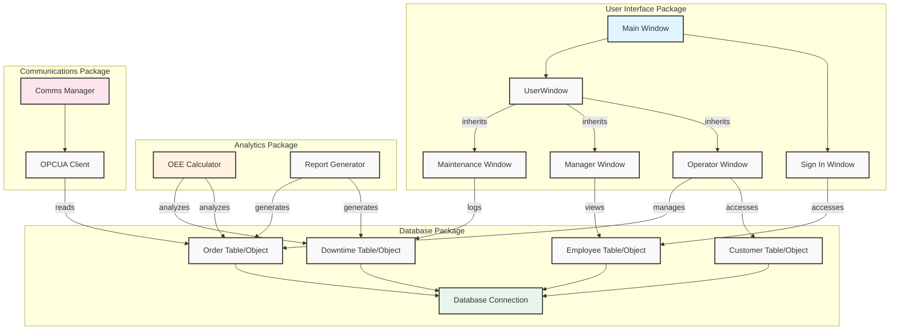
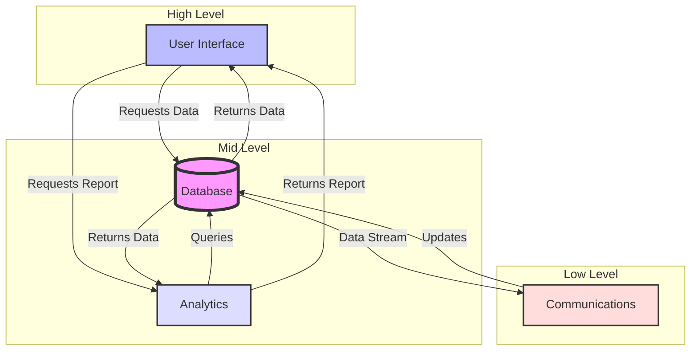
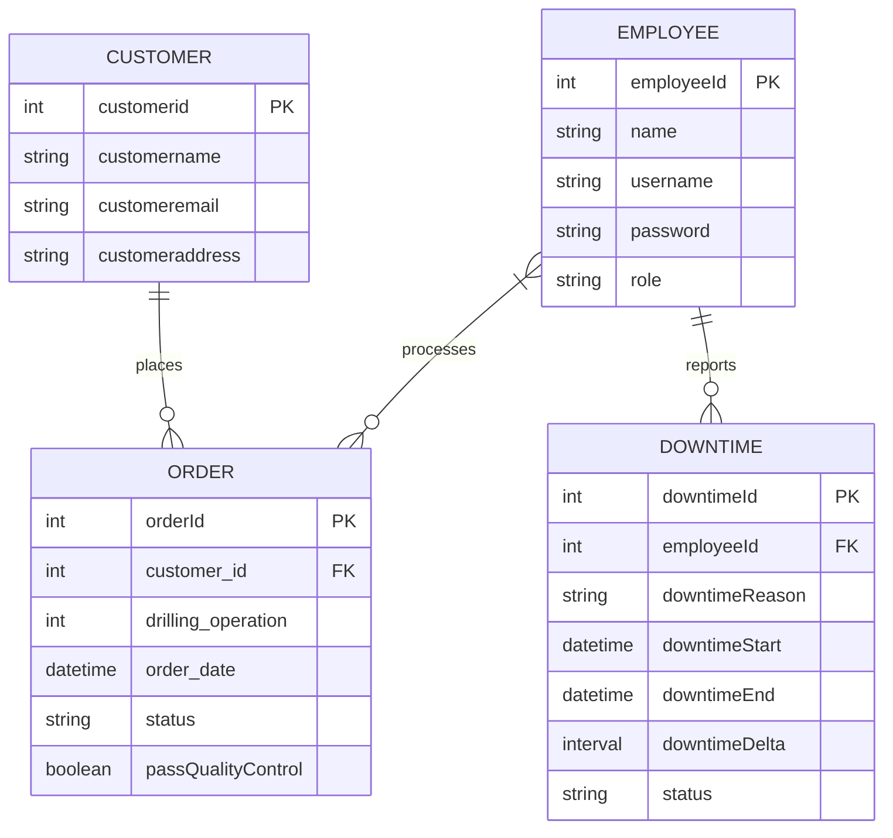
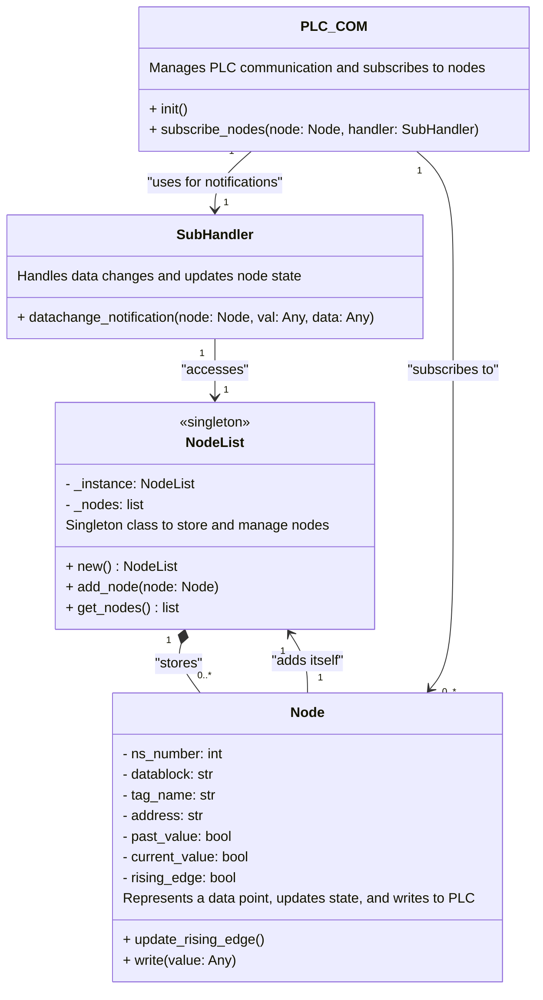

# MANF455
## A **Supercharged** MES for Your **MPS Drilling Station** 🚀🚀🚀

This document outlines the design of a **next-level** Manufacturing Execution System (MES) for your MPS Drilling Station. It's here to **revolutionize** your production process and help you make **smarter decisions** 🧠🧠🧠.

**Key Features:**

* **Real-time monitoring 👀👀👀:** Keep a **close eye** on your machine with live data.
* **Improved scheduling 🗓️🗓️🗓️:** Plan and optimize production schedules for **maximum efficiency**.
* **Enhanced decision-making 🧠🧠🧠:** Gain **valuable insights** from data to make **informed choices**.
* **Modular design 🧩🧩🧩:** Easily adapt the system to different stations with minimal changes. 

**User-Friendly Interface:**

* **Simple and intuitive UI 🧑‍💻🧑‍💻🧑‍💻:** Designed for all user types (operators, technicians, managers).
* **Operator window 👷‍♀️👷‍♀️👷‍♀️:** Submit work orders, monitor production status, and add new customers. 
* **Technician window 🔧🔧🔧:** View and manage downtime events (start/stop, reasons). 
* **Manager window 📊📊📊:** Generate reports, export data, and visualize Overall Equipment Effectiveness (OEE). 

**Under the Hood:**

* **SQLite database 💾💾💾:** Stores all your MES data securely. 
* **OPC UA communication 📡📡📡:** Talks directly to your machine for seamless data exchange. 
* **Object-Relational Mapping (ORM) 🔗🔗🔗:** Simplifies database interactions for developers. 

**Next Steps:**

This is a high-level overview of the MES design. We'll continue development and provide more details soon!

**Let's supercharge your production together! 🚀🚀🚀**

**Feel free to explore further sections using the handy Table of Contents below\!**

Markdown
# **A Supercharged MES for Your MPS Drilling Station** 🚀🚀🚀

## Table of Contents
* **[Key Features](#key-features)**
* **[User-Friendly Interface](#user-friendly-interface)**
* **[Under the Hood](#under-the-hood)**
* **[Next Steps](#next-steps)**

## Key Features
* **Real-time monitoring 👀👀👀:** Keep a **close eye** on your machine with live data.
* **Improved scheduling 🗓️🗓️🗓️:** Plan and optimize production schedules for **maximum efficiency**.
* **Enhanced decision-making 🧠🧠🧠:** Gain **valuable insights** from data to make **informed choices**.
* **Modular design 🧩🧩🧩:** Easily adapt the system to different stations with minimal changes. 

## User-Friendly Interface
* **Simple and intuitive UI 🧑‍💻🧑‍💻🧑‍💻:** Designed for all user types (operators, technicians, managers).
* **Operator window 👷‍♀️👷‍♀️👷‍♀️:** Submit work orders, monitor production status, and add new customers. 
* **Technician window 🔧🔧🔧:** View and manage downtime events (start/stop, reasons). 
* **Manager window 📊📊📊:** Generate reports, export data, and visualize Overall Equipment Effectiveness (OEE). 

## Under the Hood
* **SQLite database 💾💾💾:** Stores all your MES data securely. 
* **OPC UA communication 📡📡📡:** Talks directly to your machine for seamless data exchange. 
* **Object-Relational Mapping (ORM) 🔗🔗🔗:** Simplifies database interactions for developers. 

## Next Steps
This is a high-level overview of the MES design. We'll continue development and provide more details soon!

**Let's supercharge your production together! 🚀🚀🚀**

MES

